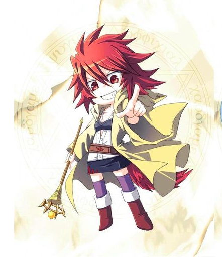
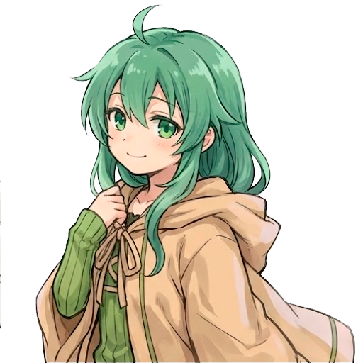

# 🎴 Personagens Charmers - Bomber Vampire

Este documento descreve os 4 personagens jogáveis baseados nas **Charmers de Yu-Gi-Oh!**, cada uma representando um elemento diferente com mecânicas únicas.

---

## 🌟 Personagens Disponíveis

### 🌿 AUSSA - Earth Charmer


**Elemento**: Terra  
**Arquétipo**: Tank/Controladora de Área  
**Cor Temática**: `#8B7355` (Marrom terroso)

#### Estatísticas
- **+2 HP Máximo**: Mais resistente que outras Charmers
- **+1 Armadura**: Reduz 1 de dano recebido
- **Explosões em Cruz**: Padrão tradicional de bomberman
- **+1 Alcance de Explosão**: Área maior de controle

#### Playstyle
Aussa é a Charmer mais defensiva. Use sua vida extra e armadura para jogar agressivamente, controlando grandes áreas com explosões em cruz de longo alcance. Ideal para iniciantes.

---

### 💧 ERIA - Water Charmer


**Elemento**: Água  
**Arquétipo**: Controladora/Debuffer  
**Cor Temática**: `#5B9BD5` (Azul água)

#### Estatísticas
- **50% Chance de Congelar**: Paralisa inimigos por tempo limitado
- **Explosões Circulares**: Padrão de área em círculo
- **-1 Dano de Explosão**: Menos letal, mas mais controle
- **+30% Velocidade**: Mais ágil para posicionamento

#### Playstyle
Eria foca em controle de multidões através de congelamento. Use explosões circulares para afetar múltiplos inimigos e aproveite a velocidade extra para evitar perigo enquanto seus inimigos ficam congelados.

---

### 🔥 HIITA - Fire Charmer



**Elemento**: Fogo  
**Arquétipo**: DPS Agressiva  
**Cor Temática**: `#E74C3C` (Vermelho fogo)

#### Estatísticas
- **+2 Dano de Queimadura**: Inimigos queimam após explosão (DoT)
- **-50% Cooldown de Bombas**: Coloca bombas muito mais rápido
- **-30% Tempo de Pavio**: Bombas explodem mais rápido
- **+1 Dano de Perfuração**: Atravessa mais resistência

#### Playstyle
Hiita é pura agressão. Com bombas extremamente rápidas e queimaduras constantes, ela domina através de pressão incessante. Alto risco, alto retorno - requer bom posicionamento para evitar se explodir.

---

### 🌪️ WYNN - Wind Charmer



**Elemento**: Vento  
**Arquétipo**: Mobilidade/Farming  
**Cor Temática**: `#52C77D` (Verde vento)

#### Estatísticas
- **+150% Velocidade**: Extremamente rápida
- **Explosões em X (Diagonal)**: Padrão diagonal único
- **+3 Alcance de Magnetismo**: Coleta XP de muito mais longe
- **Wind Spin**: Efeito visual giratório especial

#### Playstyle
Wynn é a mais móvel de todas. Use velocidade superior para kitar inimigos e posicione explosões diagonais estrategicamente. Excelente para farming de XP com magnetismo aumentado.

---

## 📊 Comparação de Personagens

| Charmer | Elemento | Dificuldade | Estilo | Melhor Para |
|---------|----------|-------------|--------|-------------|
| **🌿 Aussa** | Terra | ⭐ Fácil | Tank/Controle | Iniciantes, sobrevivência |
| **💧 Eria** | Água | ⭐⭐ Médio | Controle/Suporte | Crowd control, defesa |
| **🔥 Hiita** | Fogo | ⭐⭐⭐ Difícil | DPS/Agressão | Speedruns, agressão |
| **🌪️ Wynn** | Vento | ⭐⭐ Médio | Mobilidade/Farm | Farming XP, kiting |

---

## 🎮 Sinergias com Upgrades

### Aussa (Terra) - Melhores Upgrades
- ✅ **Armadura/Escudo**: Amplia sua natureza tanque
- ✅ **+Alcance de Bomba**: Controle ainda maior de área
- ✅ **Mega Bomba**: Compensa falta de DPS com área massiva
- ❌ **Velocidade**: Já é naturalmente lenta, evite reduzir mais

### Eria (Água) - Melhores Upgrades
- ✅ **+Congelar**: 50% base + upgrades = quase sempre congela
- ✅ **Bomba Circular/Total**: Maximize área de efeito
- ✅ **Regeneração**: Compensa falta de kill power
- ❌ **+Dano**: Ela não precisa matar, apenas controlar

### Hiita (Fogo) - Melhores Upgrades
- ✅ **+Queimadura**: DoT ainda mais alto
- ✅ **+Dano/Crítico**: Maximize letalidade
- ✅ **Pavio Curto**: Bombas já rápidas ficam instant
- ❌ **Cooldown Longo**: Contradiz estilo agressivo

### Wynn (Vento) - Melhores Upgrades
- ✅ **+XP/Magnetismo**: Maximize farming
- ✅ **+Velocidade**: Fique ainda mais inalcançável
- ✅ **Bomba Estrela (X+Cruz)**: Combine padrões
- ❌ **Vida/Armadura**: Você não deve ser atingida

---

## 🎨 Sprites e Assets

Cada Charmer possui os seguintes arquivos em sua pasta:

```
img/[Nome]/
├── sprite_universal.png   # Sprite sheet LPC (832x1344px)
├── portrait.png           # Portrait estilo JRPG (~400x400px)
├── character.char         # Arquivo do LPC Generator
└── sprite_credits.txt     # Créditos dos artistas
```

### Uso dos Portraits

Os portraits podem ser usados para:
- Tela de seleção de personagens (futuro)
- Diálogos/cutscenes
- Game over screen
- HUD avançado

**Nota**: Atualmente os portraits não são usados no jogo, mas estão disponíveis para futuras implementações de UI.

---

## 🔧 Implementação Técnica

### Código dos Personagens (`js/player.js`)

```javascript
const CHARACTERS = [
    {
        id: 'aussa',
        icon: '🌿',
        spriteSheet: 'aussa',
        name: 'AUSSA - EARTH',
        desc: 'Maga da terra. Resistente e explosiva.',
        stats: '+2 HP | +1 Armadura | Explosões em Cruz',
        color: '#8B7355',
        apply: (p) => { /* ... */ }
    },
    // ... outras charmers
];
```

### Carregamento de Sprites (`js/sprites.js`)

```javascript
const sheets = [
    { name: 'aussa', path: 'Aussa/sprite_universal.png' },
    { name: 'eria', path: 'Eria/sprite_universal.png' },
    { name: 'hiita', path: 'Hiita/sprite_universal.png' },
    { name: 'wynn', path: 'Wynn/sprite_universal.png' }
];
```

---

## 🌈 Paleta de Cores Elementais

Cada Charmer tem uma cor temática usada em efeitos visuais:

```css
/* Aussa - Terra */
--earth: #8B7355;  /* Marrom terroso */

/* Eria - Água */
--water: #5B9BD5;  /* Azul aquático */

/* Hiita - Fogo */
--fire: #E74C3C;   /* Vermelho ardente */

/* Wynn - Vento */
--wind: #52C77D;   /* Verde ventania */
```

Essas cores são usadas em:
- Aura do personagem (`player.charColor`)
- Brilho de seleção nos cards
- Efeitos de partículas (futuro)

---

## 📜 Créditos e Licenças

Todos os sprite sheets são baseados no **Universal LPC Spritesheet Generator** e seguem as licenças:
- **CC-BY-SA 3.0** - Creative Commons Attribution-ShareAlike
- **GPL 3.0** - GNU General Public License

Os créditos detalhados dos artistas estão em cada arquivo `sprite_credits.txt` respectivo.

### Charmers Original (Yu-Gi-Oh!)
As Charmers são propriedade intelectual da **Konami/Yu-Gi-Oh!**  
Este projeto usa apenas inspiração temática, não assets oficiais.

---

## 🎯 Dicas de Gameplay

### Para Iniciantes
1. **Comece com Aussa** - Mais perdoadora, vida extra
2. Foque em sobreviver, não em matar rápido
3. Use explosões em cruz para controlar corredores

### Para Intermediários
1. **Experimente Eria ou Wynn** - Mecânicas mais complexas
2. Aprenda timing de congelar (Eria)
3. Pratique kiting com velocidade (Wynn)

### Para Avançados
1. **Domine Hiita** - Alto risco, alto retorno
2. Gerencia cooldown de bombas agressivamente
3. Combine queimadura com explosões em combo

---

## 🔮 Futuras Expansões

Possíveis adições ao sistema de Charmers:

- [ ] **Familiar Charmer** - 5ª Charmer (Luz)
- [ ] **Dharc Charmer** - 6ª Charmer (Trevas)
- [ ] **Portraits no HUD** - Mostrar portrait no canto da tela
- [ ] **Diálogos de Level Up** - Frases temáticas ao subir de nível
- [ ] **Transformações Elementais** - Power-up visual temporário
- [ ] **Skins Alternativas** - Awakened Charmers, Spirit Charmers

---

*Última atualização: Fevereiro 2026*
